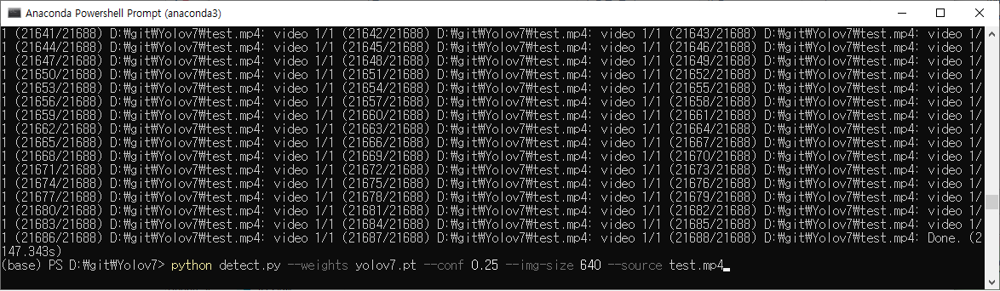

# 1. Yolov7
The codes are mainly based on yolov7.
  https://github.com/WongKinYiu/yolov7

# 2. Inference

On video:

    python detect.py --weights yolov7.pt --conf 0.25 --img-size 640 --source test.mp4

</img>

On image:

    python detect.py --weights yolov7.pt --conf 0.25 --img-size 640 --source inference/images/horses.jpg
  
