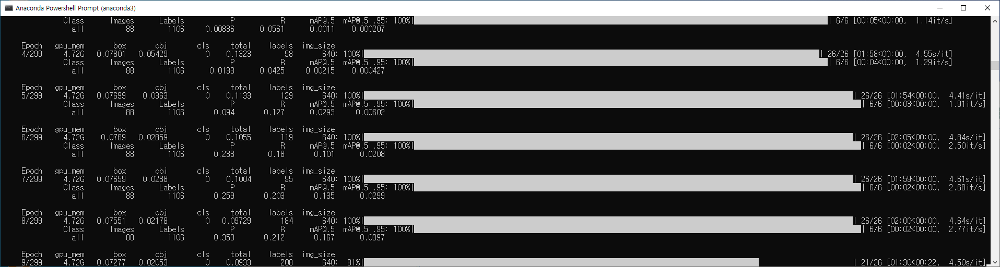

# 1. Yolov7
The codes are mainly based on yolov7.
  https://github.com/WongKinYiu/yolov7

# 2. Inference

On video:

    python detect.py --weights yolov7.pt --conf 0.25 --img-size 640 --source test.mp4

  </img>

On image:

    python detect.py --weights yolov7.pt --conf 0.25 --img-size 640 --source inference/images/horses.jpg
  
# 3. Transfer learning

Multi GPU finetuning for custom dataset:

pre-trained weights : --weights, yolov7_training.pt

labeling data and classes : --data data/unisem_custom.yaml

model cfg : --cfg cfg/training/yolov7.yaml

hyper parameter : --hyp data/hyp.scratch.custom.yaml

    python train.py --workers 4 --device 0,1 --batch-size 8 --data data/unisem_custom.yaml --img 640 640 --cfg cfg/training/yolov7.yaml --weights 'yolov7_training.pt' --name yolov7-custom --hyp data/hyp.scratch.custom.yaml
    
unisem_custom.yaml

    # train and val data as 1) directory: path/images/, 2) file: path/images.txt, or 3) list: [path1/images/, path2/images/]
    train: D:/git/Yolov7/datasets/training_key_points/images/train/ 
    val: D:/git/Yolov7/datasets/training_key_points/images/valid/  
    test: D:/git/Yolov7/datasets/training_key_points/images/test/  
    
    # number of classes
    nc: 1
    
    # class names
    names: [ 'key_object' ]
    
  </img>
    
